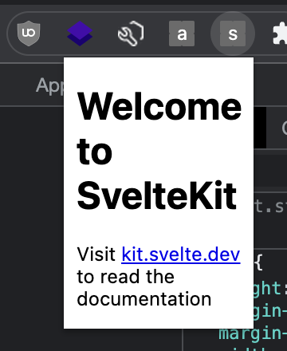

# SvelteKit Chrome Extension

1. `pnpm install`
2. `pnpm build`
3. open your browser and navigate to `chrome://extensions`
4. enable developer mode
5. select `Load unpacked` and open the `build` directory from this project

## What's here?

In `vite.config.ts` there are two custom plugins:

1. [`extensionManifestPlugin`](https://github.com/josefaidt/sveltekit-chrome-extension/blob/main/vite.config.ts#L9) - small plugin to "build" the manifest. it will remove the `$schema` key if present and write out to the build directory
2. [`extensionWorkerPlugin`](https://github.com/josefaidt/sveltekit-chrome-extension/blob/main/vite.config.ts#L53) - small plugin to build the worker file. it will leverage the same codebase as SvelteKit, meaning aliases such as `$lib` should work without additional config

In `svelte.config.js` we are changing the [`appDir`](https://kit.svelte.dev/docs/configuration) to point to `build/app` in order to mitigate issues with the browser loading the extension:

> Cannot load extension with file or directory name _app. Filenames starting with "_" are reserved for use by the system.
